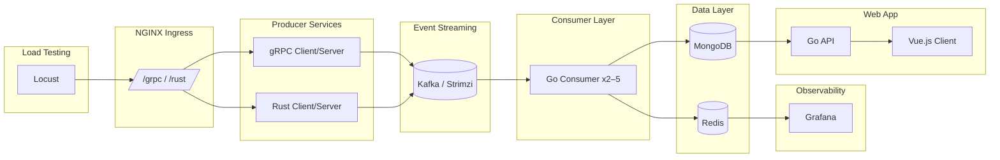
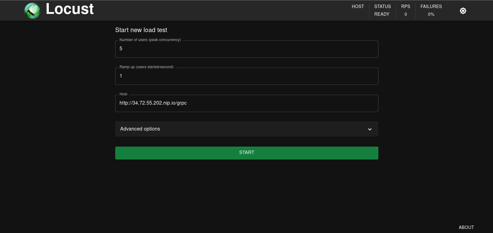
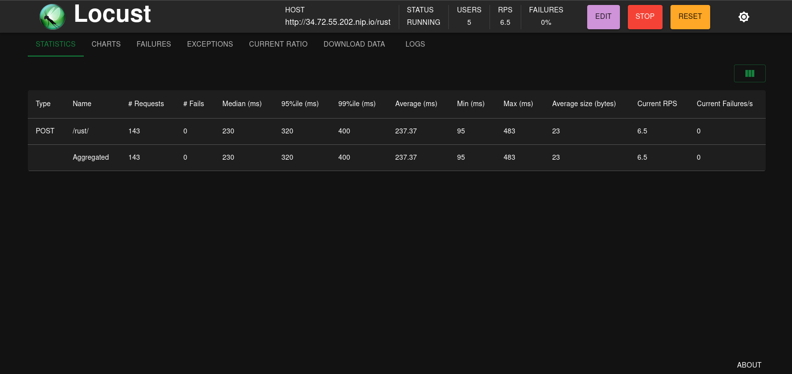
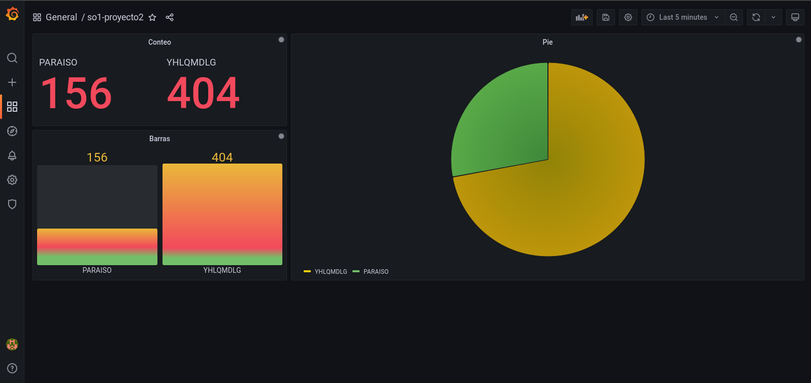
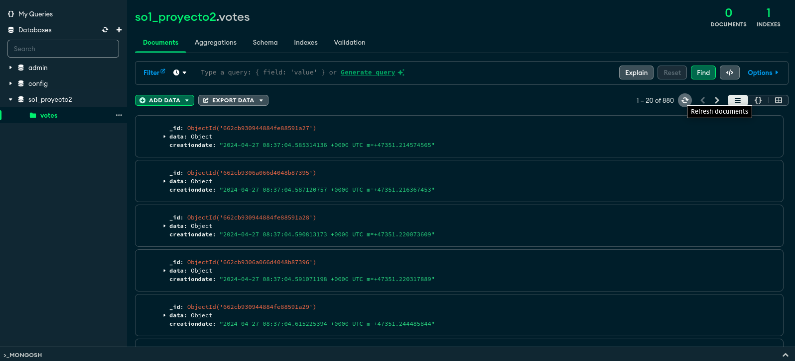

# Real-Time Voting Platform on Kubernetes

> Event-driven voting system for a Guatemalan music band contest — built to demonstrate container orchestration, message streaming, autoscaling, and observability.

**Language:** English | [Español](docs/es/README.md)

[](https://github.com/keviingarciah/realtime-voting-platform/actions/workflows/ci.yml)
[](k8s/)
[](docs/en/architecture.md)
[](LICENSE)

---

## Recruiter Quick Start

| | |
|---|---|
| **What it does** | Ingests vote traffic through gRPC and Rust producers, streams events via Kafka, persists results to Redis/MongoDB, and visualizes live rankings in Grafana. |
| **Why it matters** | Shows end-to-end DevOps ownership: containerization, K8s deployment, ingress routing, HPA autoscaling, load testing, and monitoring. |
| **Stack** | Go, Rust, Vue.js, Kafka (Strimzi), Redis, MongoDB, Grafana, GKE, NGINX Ingress, Locust |
| **Deploy time** | ~20 min on a GKE cluster with pre-built Docker images |

---

## Architecture



See [Architecture Guide](docs/en/architecture.md) for component details and design tradeoffs.

---

## Demo

### Load testing with Locust





### Real-time dashboards and persistence





---

## Key DevOps Highlights

- **Containerized microservices** — Each component ships with its own `Dockerfile` and is published to Docker Hub.
- **Kubernetes manifests** — Declarative deployments with resource limits, services, ingress, and HPA in [`k8s/`](k8s/).
- **Event-driven pipeline** — Decoupled producers and consumers using Kafka for resilience under load.
- **Horizontal Pod Autoscaler** — Consumer pods scale from 2 to 5 based on CPU utilization (40% target).
- **Ingress routing** — Single entry point exposing `/grpc` and `/rust` paths via NGINX Ingress Controller.
- **Observability** — Grafana dashboards connected to Redis for live vote visualization.
- **Load testing** — Locust simulates realistic vote traffic from JSON fixture data.

---

## Quick Start

### Prerequisites

- [Google Cloud SDK](https://cloud.google.com/sdk/docs/install) (`gcloud`)
- [kubectl](https://kubernetes.io/docs/tasks/tools/)
- [Helm 3](https://helm.sh/docs/intro/install/)
- A GKE cluster (or any Kubernetes cluster with LoadBalancer support)

### Deploy

```bash
# 1. Clone and configure your cluster context
git clone https://github.com/keviingarciah/realtime-voting-platform.git
cd realtime-voting-platform
gcloud container clusters get-credentials <cluster-name> --zone <zone>

# 2. Install NGINX Ingress Controller
./scripts/setup-ingress.sh

# 3. Deploy all application manifests
./scripts/deploy.sh

# 4. Install Kafka via Strimzi (see deployment guide)
```

Full step-by-step instructions: [Deployment Guide](docs/en/deployment.md)

### Run load tests

```bash
cd locust
pip install locust
locust -f main.py --host http://<INGRESS_HOST>
```

Open `http://localhost:8089`, set users/spawn rate, and point traffic at `/grpc` or `/rust`.

---

## Project Structure

```
realtime-voting-platform/
├── .github/workflows/   # CI pipelines (manifest validation, Go checks)
├── app/                 # Vue.js frontend + Go REST API (MongoDB logs)
├── consumer/            # Kafka consumer → Redis + MongoDB
├── producer/
│   ├── grpc/            # gRPC vote producer (Go)
│   └── rust/            # HTTP vote producer (Rust)
├── locust/              # Load testing scripts
├── k8s/                 # Kubernetes manifests (deployments, services, HPA, ingress)
├── scripts/             # Deployment automation
└── docs/
    ├── en/              # English documentation
    ├── es/              # Spanish documentation
    └── assets/          # Screenshots and diagrams
```

---

## Operational Decisions

| Decision | Rationale |
|---|---|
| Kafka via Strimzi operator | Production-grade Kafka on K8s without managing ZooKeeper manually |
| Dual producers (gRPC + Rust) | Compare protocol performance under identical load patterns |
| HPA on consumer only | Consumer is the bottleneck during vote spikes; producers stay fixed |
| Redis for live data, MongoDB for logs | Separation of hot (dashboard) vs. cold (audit/history) storage |
| Pre-built Docker images | Faster cluster bootstrap; CI can rebuild on every merge |
| LoadBalancer services | Simplifies lab/demo access; production would use ClusterIP + Ingress only |

---

## Documentation

| Document | English | Español |
|---|---|---|
| Full README | This file | [docs/es/README.md](docs/es/README.md) |
| Architecture | [docs/en/architecture.md](docs/en/architecture.md) | [docs/es/architecture.md](docs/es/architecture.md) |
| Deployment | [docs/en/deployment.md](docs/en/deployment.md) | [docs/es/deployment.md](docs/es/deployment.md) |
| K8s Cheatsheet | [docs/en/kubernetes-cheatsheet.md](docs/en/kubernetes-cheatsheet.md) | [docs/es/kubernetes-cheatsheet.md](docs/es/kubernetes-cheatsheet.md) |

---

## Author

**Kevin Garcia** — aspiring DevOps Engineer

---

## License

This project is licensed under the MIT License — see [LICENSE](LICENSE) for details.
